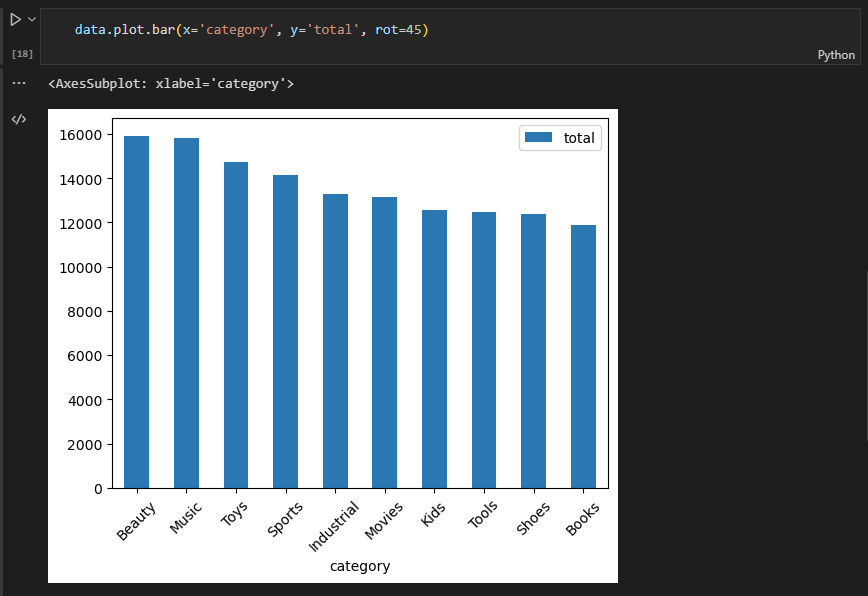

# How to practice SQL using Jupyter and SQLite? - tutorial

<br>

## 😎 Introduction

If you want to start learning SQL hands-on, it's not an easy task at all. That is why I decided to create this guide, where you will find all the information in one place that will allow you to quickly and easily start learning SQL on your computer.

In this tutorial you will learn:

- How to install the SQL engine on your computer?
- How to convert data from csv file to SQL database?
- How to connect to SQL database using Jupyter Notebook?
- How to easily transfer data from SQL database to pandas?
- How to quickly visualize data from an SQL query?

<br><br>

## 📙 Jupyter notebooks

For this tutorial I have prepared notebooks where you can find examples, code and additional information:  
1. [How to convert a csv data file to SQLite](notebooks/tutorial_sql_1.ipynb)
2. [How to connect Jupyter to SQL database?](notebooks/tutorial_sql_2.ipynb)
3. [How to visualize data from sql query](notebooks/tutorial_sql_3.ipynb)

<br><br>

## 🏆 Why SQLite?

Before we start installing anything, we need to choose the specific type of database that we will use for the exercises. There are many different SQL databases, such as MySQL, PostgreSQL, MS SQL, OracleDB, or SQLite. For practice, I recommend starting with SQLite, and here is a list of reasons why this particular database:

- it is one of the most common relational databases (e.g. there is an SQLite database in your smartphone)
- the database is very simple and is contained in one file
- does not require any prior configuration
- does not require a server such as MySQL
- it is open source and free
- it is very easy to convert data, e.g. from a csv file to SQLite (and most of the open datasets are in the form of csv files)

<br><br>

## 💾 How to install SQLite on your computer?

Each relational database for proper operation requires the installation of the SQL engine. In this case, it will be SQLite, which we install on our computer according to the instructions on the official website:

[How to install SQLItie on Windows, Mac or Linux?](https://www.tutorialspoint.com/sqlite/sqlite_installation.htm)

In the case of installation on Windows, you need to add the environment path in order to run sqlite, here is the short [video tutorial](https://www.youtube.com/watch?v=zOJWL3oXDO8&ab_channel=Codible)

<br><br>

## 🐍 + 📙 How to install Python and Jupyter? 

If you are reading this guide, I assume you have Python and Jupyter Notebook installed on your computer. If not, here are links to tutorials that show you how to install and configure it all on your computer:

- [Step by step instructions how to setup Python (videos by Luke Barousse)](https://youtu.be/xfAcErzOKN4)  
- [Installing Jupyter Notebook](https://docs.jupyter.org/en/latest/install/notebook-classic.html)

<br><br>

## 📄 How to convert a csv data file to SQLite?

One of the biggest difficulties associated with practicing SQL is the big problem with finding open data in the form of (for example) a MySQL database or a file with a SQLite database. On the other hand, there is a lot of open datasets (e.g. on [Kaggle](https://www.kaggle.com/)), which is usually in the form of csv files.

However, there is a simple way to convert any csv file to an SQLite database using the Python sqlite3 and pandas libraries.

[**Jupyter notebook with code and examples**](notebooks/tutorial_sql_1.ipynb)

<br><br>

## 🔮 How to connect Jupyter to SQL database?

The last step is to connect the Jupyter notebook to the SQLite database. For this we need to install the Python library **ipython-sql** using pip or conda:

```
pip install ipython-sql
```
or
```
conda install ipython-sql
```

Now all you have to do is add a tag in the Jupyter notebook cell. Line magic starting with %sql and connect to the database by pointing to the location of the SQLite database file.

```
%load_ext sql

%sql sqlite:///test.db
```

From now on, by entering the %sql command at the beginning of each cell, we create SQL queries to the SQLite database. If we use the %%sql command, then the entire content of the cell is treated as SQL code.

Below is a link to a notebook:

[**Jupyter notebook with code and examples**](notebooks/tutorial_sql_2.ipynb)

**Note:** I had a problem with the ipython-sql library working and I couldn't connect to the database from within Jupyter. By default, ipython-sql installs the latest version of SQLAlchemy 2.0. In my case, downgrading SQLAlchemy to version 1.4 helped.

<br><br>

## 📊 How to transfer data from SQL to pandas and make quick graphs?

An undoubted advantage of using Jupyter as an IDE for the SQL database is the ability to use other Python libraries and Python itself within one cell! We can easily convert the content returned by the SQL query to pandas DataFrame with just one line of code.

```
data = %sql SELECT * FROM table;

data = data.DataFrame()
```

[**Jupyter notebook with code and examples**](notebooks/tutorial_sql_3.ipynb)

If we have data in the form of a dataframe, nothing stands in the way of making a simple visualization using matplotlib or seaborn with just two lines of code.



This is a very useful function in the analysis of data from the SQL database, which we often receive only in the form of a table, and sometimes it is much better to present them in the form of even a simple chart.


<br><br>
